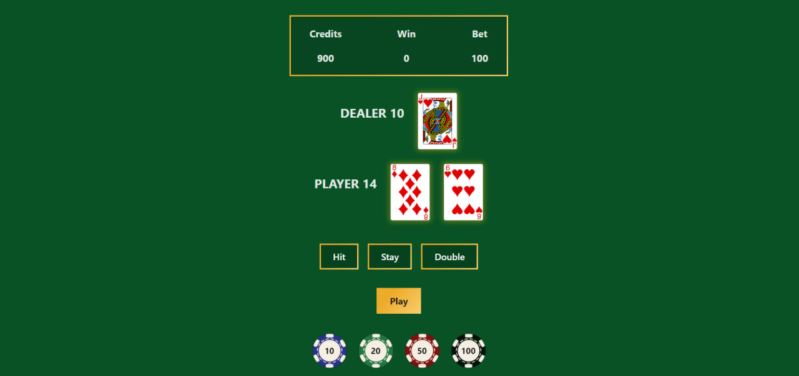

# Black Jack Game

### About:
This React-based project is an implementation of the classic card game, Blackjack. It features standard gameplay mechanics including "stay," "hit," and "double down," allowing players to place bets as they try to beat the dealer's hand.

### Demo:

### Technologies Used:

### Other Links:
- [Playing Cards](https://opengameart.org/content/playing-cards-vector-png)
